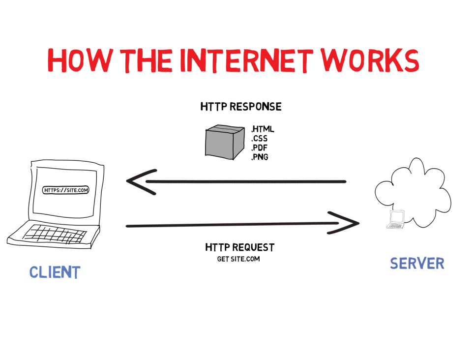

# Internet behind the scenes

## What happens when you type google.com in your browser and press Enter?

Nearly all individuals who have accessed the internet have, on one occasion in their online exploration, entered "https://www.google.com" into a browser. Have you ever pondered what takes place right after you press the enter key? In case you have ever been curious about this, then allow me to clarify that for you.

Rather than merely skimming the surface, I will delve into the intricacies so that you obtain a complete understanding and also develop technical proficiency concerning how the web operates. Do not worry, I will simplify everything as much as possible for you to comprehend.

### The Browser

Just to ensure we are on the same wavelength, I assume you are familiar with the term "browser." However, if you are not, that is perfectly fine. A browser is essentially an application that allows you to access the internet. Some common examples include 

`Google Chrome, Firefox, Vivaldi, Safari, Opera, Edge, etc.`

When you type https://www.google.com into your browser and hit Enter, a fascinating journey begins - transcending various layers of the web stack before the desired webpage graces your screen. Let's delve into this journey, demystifying the complexities involved.

### The Initiation: DNS Request

Our journey begins with a **Domain Name System** (DNS) request. The browser seeks to translate the human-friendly domain name www.google.com to an IP address, the language of computers. A query is sent to a DNS server, which acts like a phonebook for the internet, fetching the corresponding IP address for Google's server.