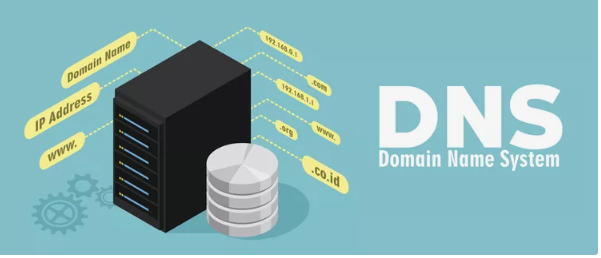

# Internet behind the scenes

## What happens when you type google.com in your browser and press Enter?

Nearly all individuals who have accessed the internet have, on one occasion in their online exploration, entered "https://www.google.com" into a browser. Have you ever pondered what takes place right after you press the enter key? In case you have ever been curious about this, then allow me to clarify that for you.

Rather than merely skimming the surface, I will delve into the intricacies so that you obtain a complete understanding and also develop technical proficiency concerning how the web operates. Do not worry, I will simplify everything as much as possible for you to comprehend.

### The Browser

Just to ensure we are on the same wavelength, I assume you are familiar with the term "browser." However, if you are not, that is perfectly fine. A browser is essentially an application that allows you to access the internet. Some common examples include 

`Google Chrome, Firefox, Vivaldi, Safari, Opera, Edge, etc.`

When you type https://www.google.com into your browser and hit Enter, a fascinating journey begins - transcending various layers of the web stack before the desired webpage graces your screen. Let's delve into this journey, demystifying the complexities involved.

### The Initiation: DNS Request

Our journey begins with a **Domain Name System** (DNS) request. The browser seeks to translate the human-friendly domain name www.google.com to an IP address, the language of computers. A query is sent to a DNS server, which acts like a phonebook for the internet, fetching the corresponding IP address for Google's server.

 ### The Protocol Suite: TCP/IP

With the IP address at hand,**Transmission Control Protocol/Internet Protocol** (TCP/IP) - the protocol suite - kicks in. TCP establishes a reliable connection between your machine and Google's server, ensuring data integrity and order. IP, on the other hand, is responsible for routing the data packets to the correct destination.This entire process is known as a **"handshake."**

Here is what happens in greater detail

* The browser uses IP to send a request to the server to establish a connection.

* The server receives the request and sends a message back acknowledging the request to establish a connection.( handshake procedure.)

* Once the handshake is completed, the browser can use TCP to send a request for the webpage it wants to access (in this instance, the homepage of google.com). This request is made using TCP, which ensures that the request is sent reliably and in the correct sequence.

* The server receives the request and sends the HTML code for the homepage of google.com back to the browser.  This response is also sent using TCP to ensure dependable transmission.

* The browser receives the HTML code and uses it to display the webpage on your screen. Any resources (such as images) that the webpage requires are also requested and received using TCP/IP.

### The Guard: Firewall

A firewall is a security system that regulates and monitors incoming and outgoing network traffic based on predetermined security policies. Its primary objective is to safeguard a network from external threats, such as hackers and malware.

When you type a URL like "google.com" into your browser, the request that your browser makes to Google's server passes through the firewall en route. The firewall examines the incoming request to ensure that it is permitted based on its security policies.

There are two primary types of security policies that a firewall employs to examine incoming requests:

* policies that allow or prohibit traffic based on the origin and destination of the request. For example, a firewall may be programmed to block all traffic from specific countries or to allow only specific IP addresses to access the network.

* policies that allow or prohibit traffic based on the type of traffic. For example, a firewall may be programmed to block all traffic on certain ports (such as those used by malware) or to allow only certain types of traffic (such as HTTP or HTTPS).

### The Secure Passage: HTTPS/SSL

Once the connection is established, your browser sends a request for the webpage using a security protocol like **SSL (Transport Layer Security) or TLS (Transport Layer Security)** to encrypt the data that will be exchanged between your computer and the server. This encryption is responsible for the "s" in "https" (Hypertext Transfer Protocol Secure), indicating a secure connection.

When your browser connects to Google's server using HTTPS, it agrees with Google's server on the version of SSL/TLS to use and creates a secure, encrypted channel for data transmission.

To explain what is happening here, let me use an analogy.

HTTPS is like a locked box used to send messages over the internet. When you use HTTPS to send a message, you put it in the locked box and send it to the recipient. Only the recipient has the key to unlock the box and read the message.

SSL/TLS are like special codes used to lock and unlock the box. When you use HTTPS to send a message, you and the recipient agree on the code to use to lock and unlock the box. This way, only you and the recipient know the code and can read the message.

When you enter "google.com" into your browser, the browser is like the sender of the message. The server hosting google.com is like the recipient. The browser sends a request for the webpage using HTTPS, which is like putting the request in a locked box and sending it to the server. The server then sends the webpage back to the browser using HTTPS, which is like putting the webpage in the locked box and sending it back to the browser.

### The Distributor: Load Balancer

A load balancer is a tool that distributes incoming network traffic across a group of servers or resources. Its main function is to ensure that the traffic is distributed evenly across the servers to prevent overloading any single server and to increase the overall capacity and reliability of the system.

Google, which receives billions of website visitors a day, requires many servers to serve all these users. Therefore, they need to set up a load balancer to ensure that some servers are not overburdened while others are underutilized. When a browser tries to access google.com, the load balancer receives the incoming request from the browser and forwards it to one of the servers in the Google server network. The server chosen will depend on the type of load balancing algorithm implemented.

### The Frontman: Web Server 

A web server is a software that is in charge of managing requests for web pages from clients (such as a browser attempting to access google.com). When a client sends a request for a web page to a website server, the server handles the request and returns the appropriate response to the client.

This means that Google's server will obtain a request from the load balancer when attempting to access google.com.

The web server would then handle the request and produce a response, which would usually consist of the HTML, CSS, and JavaScript files that make up the web page.

The website server would then send this response back to the load balancer, which would forward it to the browser. The browser would then use the HTML, CSS, and JavaScript files to display the web page for the user.

### The Processor: Application Server and The Storer: Database

Unlike the web server, the application server handles **dynamic content**. When using "google.com," the application server will be responsible for producing the search results (which change based on the query you input into the search engine).

When you submit a search query to Google, the request is first sent to the load balancer, which forwards it to one of the web servers in the Google server network. The web server then sends the request to the application server, which handles the request and produces the search results. Depending on the complexity of the search query, the application server may need to make a request to a database to retrieve the necessary data.

For instance, if you are searching for a particular product on an e-commerce website, the application server may need to obtain information about the product from a database.

Once the application server has acquired the required data, it sends it back to the website server, which includes it in the response that is sent back to the browser. The browser then uses this information to display the search results to you.

### The Grand Finale: Rendering

When a browser receives a response from a website server, it processes the HTML, CSS, and JavaScript files that are included in the response in order to display the web page. The displaying process involves interpreting the HTML and CSS code, displaying any images or other media that are included on the page, and executing any JavaScript code that is present on the page.

In your instance, your browser would receive the response from the website server, which includes the HTML, CSS, and JavaScript files that make up the Google web page. The browser will utilize these files to display the webpage and present it to you. This method typically includes the following:

* presenting the text and pictures on the webpage in the appropriate positions
* arranging the text and design in line with the CSS styles
* performing any JavaScript code that exists on the webpage
* After the webpage has been entirely displayed, you can now engage with it by pressing links, typing text, or interacting with other features on the webpage.

In conclusion, I hope that this short blog has given you a better understanding of everything that occurs "under the hood" when you type www.google.com into your browser and press Enter.

